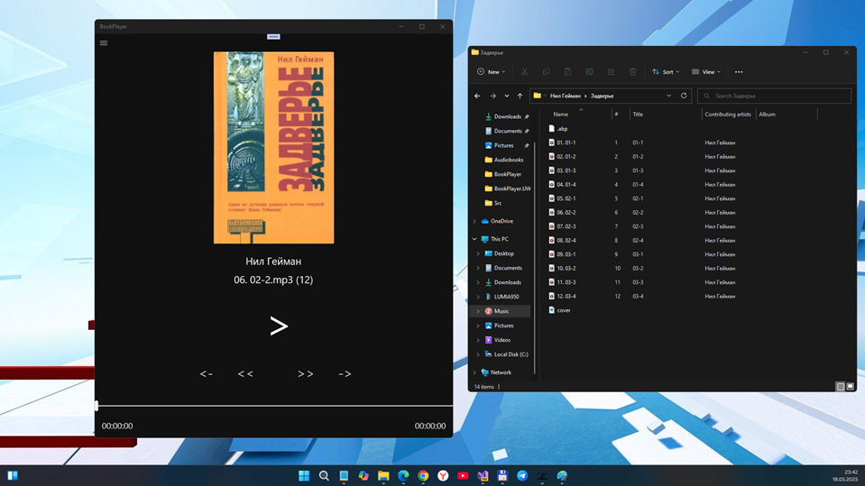

# BookPlayer 1.0.0.0-alpha - master branch

My fork of BookPlayer project for micro-RnD (XamarinMediaManager Windows compatibility questions, etc.). Draft / early bird.

## About (words of the author of original)
Quickly made audio book player mobile app for Android. It uses [BaseFlow/XamarinMediaManager](https://github.com/Baseflow/XamarinMediaManager) under the hood and has simple UI for the playing files and showing library content. 

I have no plans to develop this further, but maybe this can be a useful draft project for someone to see how XamarinMediaManager can be easily used.

## Features
- Made with .NET (Visual Studio, Xamarin.Forms)
- Android app is functional. Also iOS project draft exists
- Two main views: player and "bookshelf". In addition there's simple settings page to specify book library folder path
- Light/dark theme
- Lock screen and quick access media playing controls provided by XamarinMediaManager
- Currently supports and parses only books with its metadata in [SMIL](https://en.wikipedia.org/wiki/Synchronized_Multimedia_Integration_Language) format. All files (.html, .mp3 and .smil) related to a specific book needs to be in one folder.

## Screenshots

## My "2 cents"
- UWP "workload" added only (no solution tuning)
- Xamarin Forms downgraded from 5.0 to 4.8.
- I Fixed issue "if no book metadata then exception" ... but I not realized file attributes ("properties") reading (author, total time...)
- If only mp3 file without .jpg, it may be dandgerous (exception?)
- W10M (build 15063) compatibility added by special way (see UWP project file & manifest file)

## Errors / Bugs
- Player modes is not good (no total time info, no Chapter indication, no normal track switching or progressbar controlling...)
- W10M app settings not correct (only \Audiobooks path shown... instead of C:\....)

## TODO
- Try to downgrade Xamarin Forms version (and switch common module from .NET 2 to 1.4...) 
- Try to add MediaManager.Forms repo... and improve UI (buttons, etc.)

## License
Licensed under the MIT license.

## References
- https://github.com/ilpork/BookPlayer oroginal BookPlayer project ( for Android, and iOS ? ) 
- https://github.com/ilpork ilpork, cool c# developer
- https://www.loyalbooks.com/ Free Public Domain Audiobooks Downloads (I taked only few books for testing purposes...)

## ..
As is. No support. RnD only.

## .
[M][E] 2025
